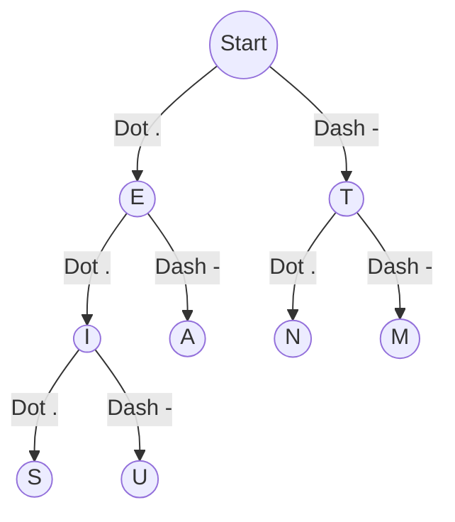

# Morse Code Decoder: Code Breakdown and Explanation

This document provides a comprehensive, step-by-step breakdown of the Morse code decoder built in `main.cpp`.

## High-Level Summary
This program is a **Morse Code Decoder** implemented in modern C++ (C++14 or newer). It converts a string of dots (`.`) and dashes (`-`) into English alphanumeric text.

The core of the logic revolves around a **Binary Tree** data structure:
- Starting at the root node, reading a `.` (dot) translates to moving to the **left child**.
- Reading a `-` (dash) translates to moving to the **right child**.

When the sequence ends, the character stored at that specific node is returned. The tree relies heavily on `std::unique_ptr` to ensure automatic, safe memory management (RAII pattern) without memory leaks.

---

## Visualizing the Morse Binary Tree
To understand the structure before diving into the code, here is what the top portion of the tree looks like.


Every letter and number has a distinct path from the root.

---

## Step-by-Step Code Walkthrough

### 1. The Building Blocks: The `Node` Structure
```cpp
struct Node {
    char data;
    std::unique_ptr<Node> dot;  // left subtree
    std::unique_ptr<Node> dash; // right subtree

    explicit Node(char c = '\0') : data(c), dot(nullptr), dash(nullptr) {}
};
```
- **What it does:** Represents a single point in the binary tree. 
- **`data`**: Holds the English character (e.g., `'A'`). It starts as `\0` (null character) to represent nodes that don't hold a value natively but are stepping stones in a path.
- **`dot` / `dash`**: Pointers to the left and right children respectively. By using `std::unique_ptr`, we guarantee that if a parent node is deleted, its children are instantly and safely cleaned up, preventing memory leaks.
- **Constructor:** Initializes the node with character `c` or `\0` by default.

### 2. The Core Engine: `MorseTree` Class
The `MorseTree` encapsulates all functionality related to the translation logic.

#### Initialization & Tree Building
```cpp
class MorseTree {
public:
    MorseTree() : root(std::make_unique<Node>()) {
        initialize();
    }
// ...
private:
    std::unique_ptr<Node> root;
// ...
```
- A default node (the `root`) is instantiated. 
- `initialize()` is immediately called within the constructor.

```cpp
    void initialize() {
        static const std::vector<std::pair<char, std::string>> alphabet = {
            {'A', ".-"},   {'B', "-..."}, /* ... */ {'0', "-----"}
        };
        for (const auto& item : alphabet) {
            insert(item.first, item.second);
        }
    }
```
- **What it does:** Contains a hardcoded dictionary map of every alphanumeric character to its Morse representation. It loops through this dictionary and feeds it into the `insert` method.

#### Inserting values into the Tree
```cpp
    void insert(char ch, const std::string& code) {
        Node* current = root.get();
        for (char symbol : code) {
            if (symbol == '.') {
                if (!current->dot) current->dot = std::make_unique<Node>();
                current = current->dot.get();
            } else if (symbol == '-') {
                if (!current->dash) current->dash = std::make_unique<Node>();
                current = current->dash.get();
            }
        }
        current->data = ch;
    }
```
- **What it does:** Starting at the root, it parses a Morse string character by character. 
- If a child node for a `.` or `-` doesn't exist yet, it **creates it on the fly** (`make_unique<Node>()`).
- After walking down the correct path, the very last node receives the assignment `current->data = ch;`.

#### Decoding a Single Letter
```cpp
    char decode_char(const std::string& code) const {
        Node* current = root.get();
        for (char symbol : code) {
            if (symbol == '.') {
                if (!current->dot) return '?';
                current = current->dot.get();
            } else if (symbol == '-') {
                if (!current->dash) return '?';
                current = current->dash.get();
            }
        }
        return (current->data != '\0') ? current->data : '?';
    }
```
- **What it does:** Traces the path down the tree given a Morse string (like `.-`). 
- If part of the path is missing (e.g., someone types `.......`), it catches it and immediately returns `?` indicating an invalid sequence.
- Returns the data stored at the final node.

#### Parsing a Full Sentence
```cpp
    std::string decode_message(const std::string& message) const {
        std::string result;
        std::string current_symbol_seq;
        
        for (size_t i = 0; i < message.size(); ++i) {
            char c = message[i];
            
            if (c == '.' || c == '-') {
                current_symbol_seq += c; // Accumulate the symbols for a single letter
            } else if (c == ' ') {
                if (!current_symbol_seq.empty()) { // End of a letter reached
                    result += decode_char(current_symbol_seq);
                    current_symbol_seq.clear();
                }
                
                // Handling multiple spaces for word breaks
                if (i + 1 < message.size() && message[i+1] == ' ') {
                    if (result.empty() || result.back() != ' ') {
                        result += ' ';
                    }
                }
            }
        }
        
        // Edge case: Add final letter if the string doesn't end with a space
        if (!current_symbol_seq.empty()) {
            result += decode_char(current_symbol_seq);
        }
        return result;
    }
```
- **What it does:** It iterates through the entire raw input.
- Groups consecutive dots and dashes together in the buffer `current_symbol_seq`.
- When an empty space is encountered, it flushes the buffer to `decode_char()` and appends the decoded character to the `result`.
- It smartly checks ahead (`message[i+1] == ' '`) to see if consecutive spaces exist. If so, it interprets those as a separation between words, appending a literal space `' '` to the `result`.

### 3. The CLI Interface: `main` loop
```cpp
int main() {
    MorseTree decoder;
    // ... CLI Output omitted ...
    
    std::string input;
    while (true) {
        std::cout << "Morse > ";
        if (!std::getline(std::cin, input) || input == "exit") break;
        if (input.empty()) continue;

        std::string result = decoder.decode_message(input);
        std::cout << "Text  > " << result << "\n\n";
    }
    return 0;
}
```
- Creates an instance of `MorseTree` (which automatically builds the binary tree behind the scenes).
- Initiates an infinite loop using `std::getline` to accept user input.
- Quits gracefully if the user types `exit` or if an EOF signal is triggered (Ctrl+C / Ctrl+D).

---

## Pitfalls & Edge Cases
1. **Invalid Characters:** If the user inputs anything other than `-`, `.`, or ` `, it is silently scrubbed and ignored during the `decode_message` evaluation. A user typing `hello....` would technically just trigger `....`. 
2. **Buffer Flush on End:** A common bug when writing parsers is forgetting the last chunk of buffer data if the line doesn't end with a delimiter structure. Lines `61-63` beautifully handle that edge case.
3. **Trailing and Extra Spaces:** The code prevents multiple output spaces by ensuring `result.back() != ' '`. So 2 spaces, 3 spaces, or 7 spaces between Morse strings will all gracefully produce exactly 1 standard space break.

## Suggested Next Steps
- **Add Reverse Capability:** Adding an `encode_message(string)` functionality. While you have the tree for _decoding_, encoding would require either a recursive tree lookup, or more simply, maintaining a flat map `std::map<char, std::string>` locally.
- **Implement Audio Input:** Extending the CLI loop to parse long/short audio beeps (or even keystroke durations pressed on a `.exe` file interface).
