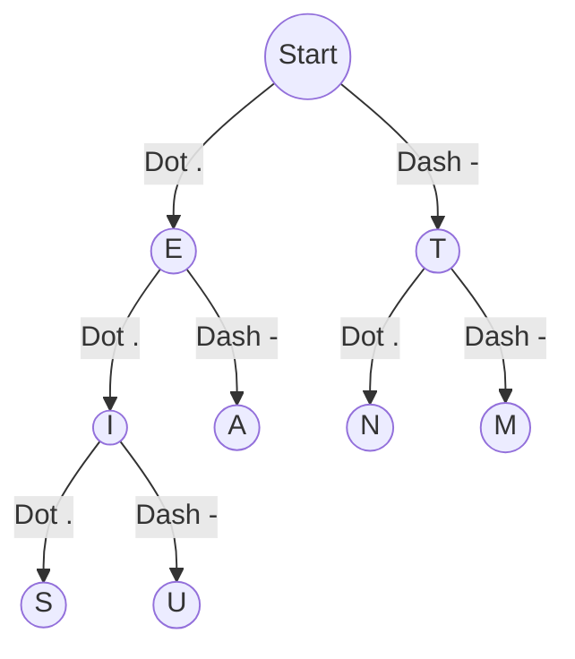

# 🛰️ Tactical Morse Network Simulation

> **A high-fidelity simulation of an autonomous campus communication network integrating Graph Theory and Neural Morse Decoding.**


---

## 🌌 Overview

The **Tactical Morse Network Simulation** is a dual-interface application (CLI + Web) that demonstrates the intersection of **Dijkstra’s Shortest Path Algorithm** and **Binary Tree Data Structures**. 

It simulates a campus environment where "Smart Locations" (e.g., Hostel, Lab, Admin) are interconnected. When a message is sent, the system:
1.  **Encodes** the payload into Morse Signal.
2.  **Optimizes** the physical route using Graph Theory.
3.  **Relays** the signal through a chain of nodes.
4.  **Decodes** the pulse back into human-readable text at the destination.

---

## 🏗️ System Architecture

### 1. Shortest Path Protocol (Graph Theory)
The network is modeled as a **Weighted Undirected Graph**. 
- **Nodes**: Campus locations.
- **Edges**: Physical links with associated "transmission costs" (weights).
- **Engine**: Dijkstra’s Algorithm utilizing a `std::priority_queue` for $O((E+V) \log V)$ efficiency.

### 2. Neural Decoder Matrix (Binary Tree)
Decoding is handled by a static **Prefix Tree (Trie)**.
- **Dots (.)**: Traversal to the `left` child.
- **Dashes (-)**: Traversal to the `right` child.
- **Lookup**: $O(L)$ where $L$ is signal length.



---

## 💻 Code Breakdown (`main.cpp`)

### 🧠 The `MorseSystem` Class
Handles the conversion layer. It manages a `std::unique_ptr<Node>` root based tree for safety and a `std::map<char, string>` for $O(1)$ encoding performance.
- `encode()`: High-speed lookup for text-to-signal conversion.
- `decode()`: Iterative traversal of the Binary Tree based on pulse patterns.
- `insert()`: Dynamically builds the tree structure on startup.

### 📍 The `CampusNetwork` Class
The "Physical Layer" of the simulation.
- `addConnection()`: Establishes bidirectional links between locations.
- `findShortestPath()`: The core **Dijkstra** implementation. It tracks `dist` (cumulative cost) and `parent` (route history) to reconstruct the optimal path after solving.

### 🎮 The `main()` Loop
An interactive CLI loop that allows users to:
1.  **Simulate Transmissions**: See step-by-step relaying.
2.  **Modify Topology**: Add/Update campus connections in real-time.
3.  **Inspect Nodes**: View the current network state.

---

## 🎨 Web Interface (`index.html`)

The project includes a **high-end, tactical HUD interface** for visual demonstration.

- **Strategic Pathfinder**: An SVG-rendered map that highlights the optimal route in real-time.
- **Neural Decoder Matrix**: A recursive visual representation of the Morse Binary Tree.
- **Signal Pulse**: Smooth animations (via Anime.js) showing the data packet traveling through links.
- **Glassmorphic Design**: A premium dark-mode aesthetic with cyan-neon accents.

---

## 🛠️ Getting Started

### C++ CLI Version
Compile using any modern C++ compiler (G++, Clang, MSVC):
```bash
g++ -o morse_sim main.cpp
./morse_sim
```

### Web Interface
Simply open `index.html` in any modern browser (Chrome, Safari, Edge). **No server required.**

---

## 📝 License
This project is released under the **MIT License**. Created for educational demonstration of graph theory and tree structures.
